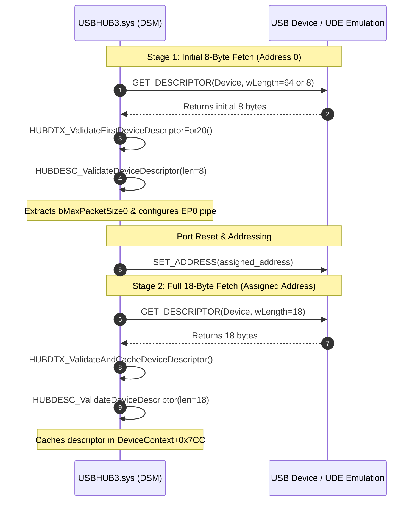

# Reverse-Engineering Findings: USB Device Descriptor Validation in the Windows USB Stack

This document details how the Windows USB core stack (`USBHUB3.sys`, `udecx.sys`, and `ucx01000.sys`) validates the **USB Device Descriptor** (`USB_DEVICE_DESCRIPTOR`) during device enumeration.

---

## 1. Architectural Overview & Component Responsibilities

| Component | Responsibility in Descriptor Validation |
| :--- | :--- |
| **`USBHUB3.sys`** | **Central Validation Authority**: Drives the Device State Machine (DSM), issues control transfers for descriptors, performs all structural and spec-compliance validations, and handles PnP/ETW failure reporting. |
| **`udecx.sys`** | **Virtual Controller Framework**: Handles port state and virtual endpoint pipes. Performs **no descriptor validation**; blindly passes descriptors to `USBHUB3.sys`. |
| **`ucx01000.sys`** | **USB Host Controller Extension**: Programs controller endpoint contexts based on validated parameters from `USBHUB3.sys`. Performs **no descriptor validation**. |

---

## 2. The Two-Stage Device Descriptor Enumeration Sequence

Windows USB 2.0 / 3.0 enumeration queries the Device Descriptor in two distinct stages:



### Stage 1: Initial 8-Byte Read (`HUBDTX_ValidateFirstDeviceDescriptorFor20`)
- **State**: `HUBDSM_ValidatingDeviceDescriptorInEnumAtZero`
- **Purpose**: Determine `bMaxPacketSize0` before resetting the bus or setting the device address.
- **Buffer Check**: Verifies `TransferBufferLength >= 8`.
- If `< 8`, sets failure code `0x40010005`, logs ETW event `0x56`, transitions to state `0xFE1`.
- Calls [`HUBDESC_ValidateDeviceDescriptor`](#3-core-validation-engine-hubdesc_validatedevicedescriptor) with `Length = 8`.
- On success:
  - Extracts byte 7 (`bMaxPacketSize0`) to `DeviceContext+0xA0`.
  - Caches first 8 bytes in `DeviceContext+0x7CC`.
  - Checks Kingston/Phison flash drive quirk (`idVendor == 0x13FE && idProduct == 0x5200`).

### Stage 2: Full 18-Byte Read (`HUBDTX_ValidateAndCacheDeviceDescriptor`)
- **State**: `HUBDSM_ValidatingDeviceDescriptorAfterAddressing`
- **Buffer Check**:
  - If `TransferBufferLength == 0`: sets failure `0x40010000`, logs ETW `0x54`.
  - If `TransferBufferLength != 18` (`0x12`): sets failure `0x40010005`, logs ETW `0x53`.
- Calls [`HUBDESC_ValidateDeviceDescriptor`](#3-core-validation-engine-hubdesc_validatedevicedescriptor) with `Length = 18`.
- On success:
  - Caches all 18 bytes into `DeviceContext+0x7CC`.
  - If Billboard device class, flags `DeviceContext+0x668 |= 0x20000`.

---

## 3. Core Validation Engine: `HUBDESC_ValidateDeviceDescriptor`

The routine `HUBDESC_ValidateDeviceDescriptor` performs field-by-field validation of `USB_DEVICE_DESCRIPTOR`:

```cpp
typedef struct _USB_DEVICE_DESCRIPTOR {
    UCHAR  bLength;            // [Offset 0x00] Must be >= 18 (0x12)
    UCHAR  bDescriptorType;    // [Offset 0x01] Must be 1 (USB_DEVICE_DESCRIPTOR_TYPE)
    USHORT bcdUSB;             // [Offset 0x02] USB specification version (BCD)
    UCHAR  bDeviceClass;       // [Offset 0x04] Class code
    UCHAR  bDeviceSubClass;    // [Offset 0x05] Subclass code
    UCHAR  bDeviceProtocol;    // [Offset 0x06] Protocol code
    UCHAR  bMaxPacketSize0;    // [Offset 0x07] Max packet size for Endpoint 0
    USHORT idVendor;           // [Offset 0x08] Vendor ID
    USHORT idProduct;          // [Offset 0x0A] Product ID
    USHORT bcdDevice;          // [Offset 0x0C] Device release number (BCD)
    UCHAR  iManufacturer;      // [Offset 0x0E] Manufacturer string index
    UCHAR  iProduct;           // [Offset 0x0F] Product string index
    UCHAR  iSerialNumber;      // [Offset 0x10] Serial number string index
    UCHAR  bNumConfigurations; // [Offset 0x11] Number of configurations
} USB_DEVICE_DESCRIPTOR;
```

### Detailed Validation Rules

| Field / Condition | Validation Rule | Failure Code | Error Name | Impact |
| :--- | :--- | :--- | :--- | :--- |
| **Pointer** | `pDescriptor != NULL` | `0x4F` | `DescriptorValidationErrorDeviceDescriptorMissing` | **Fatal** |
| **Buffer Size** | `TransferBufferLength >= 2` | `0x47` | `DescriptorValidationErrorLengthLessThanHeaderLength` | **Fatal** |
| **Buffer Size (Stage 1)** | `TransferBufferLength >= 8` | `0x47` | `DescriptorValidationErrorLengthLessThanHeaderLength` | **Fatal** |
| **`bLength`** | `bLength >= 18` (`0x12`) | `0x46` | `DescriptorValidationErrorDeviceDescriptorInvalidLength` | **Fatal** |
| **`bDescriptorType`** | `bDescriptorType == 1` | `0x4D` | `DescriptorValidationErrorDeviceDescriptorInvalidDescriptorType` | **Fatal** |
| **`bcdDevice`** | Each 4-bit nibble $\le 9$ (valid BCD) | `0x45` | `DescriptorValidationErrorDeviceDescriptorBcdDeviceNotBcd` | **Warning** (logged to ETW, non-fatal) |
| **Billboard Class** (`Class=0x11, Sub=0, Proto=0`) | `bcdUSB >= 0x0201` (`0x0201..0x02FF`) | `0xF6` | `DescriptorValidationErrorBillboardDeviceBcdUsbInvalid` | **Fatal** |
| **`bMaxPacketSize0`** | Must match device operating speed (see table below) | `0x4E` | `DescriptorValidationErrorDeviceDescriptorMaxPacketSizeInvalid` | **Fatal** (unless relaxed by quirk) |

---

## 4. `bMaxPacketSize0` Rules by Operating Speed

The device's operating speed is determined from port status (`DeviceContext+0x04`). `USBHUB3.sys` strictly enforces:

| Speed | Enum Value | Allowable `bMaxPacketSize0` | Spec Reference | Behavior on Mismatch |
| :--- | :---: | :--- | :--- | :--- |
| **Low-Speed** | `0` | Exactly `8` | USB 2.0 Spec §5.5.3 | Error `0x4E`, validation fails |
| **Full-Speed** | `1` | `8`, `16`, `32`, or `64` | USB 2.0 Spec §5.5.3 | Error `0x4E`, validation fails |
| **High-Speed** | `2` | Exactly `64` (`0x40`) | USB 2.0 Spec §5.5.3 | Error `0x4E`, validation fails |
| **SuperSpeed / SuperSpeedPlus** | `3`+ | Exactly `9` ($2^9 = 512$ bytes) | USB 3.0 Spec §9.6.1 | Error `0x4E`, validation fails |

> [!IMPORTANT]
> Because `udecx.sys!EvtRootHubGetPortStatus` unconditionally reports `PORT_HIGH_SPEED` (`0x0400`) on USB 2.0 virtual ports, `USBHUB3.sys` marks devices attached to UDE ports as **High-Speed** (`Speed = 2`). Consequently:
> - `bMaxPacketSize0` **MUST be 64**. If a Full-Speed device reported `8`, `16`, or `32`, `USBHUB3.sys` would reject it with error `0x4E`!
> - Bulk endpoints must have `wMaxPacketSize = 512` (error `0x3C` if 64, as resolved in commit [`bcf42838`](file:///D:/usbip-win2/drivers/ude/wsk_receive.cpp#L120-L122)).

---

## 5. Strict Enforcement vs. Legacy Quirk Relaxation

`USBHUB3.sys` evaluates `HUBDESC_ShouldEnforceWin8ValidationMutable` based on `bcdUSB`:

```text
if (bcdUSB >= 0x0300) -> STRICT ENFORCEMENT ALWAYS ACTIVE
if (bcdUSB >= 0x0201) -> STRICT ENFORCEMENT ALWAYS ACTIVE
if (bcdUSB <= 0x0200) -> Controlled by HardwareVerifier registry override:
                         HKLM\System\CurrentControlSet\Control\usb\HardwareVerifier
```

- When strict enforcement is active, any `bMaxPacketSize0` mismatch or descriptor violation immediately halts enumeration.
- For legacy devices (`bcdUSB <= 0x0200`), if the registry flag is disabled, certain non-critical violations emit ETW warnings rather than failing the device.

---

## 6. Multi-Configuration and Composite Device Processing

During configuration descriptor inspection (`HUBDTX_ValidateAndCacheConfigDescriptor`), `USBHUB3.sys` cross-references the cached Device Descriptor:

1. **Multi-Configuration Flag**:
   - If `bNumConfigurations > 1` (`DeviceDescriptor.bNumConfigurations > 1`), `USBHUB3.sys` sets bit 7 (`0x80`) in `DeviceFlags` (`DeviceContext+0x670`).
2. **Composite Device Detection (USBCCGP)**:
   - Sets composite flag (`DeviceContext+0x668 |= 0x04`) if either:
     - `bDeviceClass == 0xEF`, `bDeviceSubClass == 0x02`, `bDeviceProtocol == 0x01` (Interface Association Descriptor / IAD class).
     - `bDeviceClass == 0x00` and the device contains multiple interfaces (`bNumInterfaces > 1`) or an Interface Association Descriptor (`bDescriptorType == 0x0B`).
   - The composite flag causes Windows PnP to load `usbccgp.sys` (Common Class Generic Parent driver) to create child PDOs for each function.

---

## 7. Enumeration Failure Mapping & PnP Diagnostics

When descriptor validation fails, `USBHUB3.sys` maps internal failure codes to PnP Hardware IDs via `HUBID_GetUnknownId`:

| Internal Code | Hardware ID Generated | Friendly Name in Device Manager | Description |
| :---: | :--- | :--- | :--- |
| `0x40010005` | **`USB\DEVICE_DESCRIPTOR_VALIDATION_FAILURE`** | *Unknown USB Device (Device Descriptor Validation Failure)* | `HUBDESC_ValidateDeviceDescriptor` failed validation checks. |
| `0x40010000` | **`USB\DEVICE_DESCRIPTOR_FAILURE`** | *Unknown USB Device (Device Descriptor Request Failed)* | Control transfer timed out or device returned handshake `STALL` on `GET_DESCRIPTOR(Device)`. |
| `0x40010004` | **`USB\CONFIGURATION_DESCRIPTOR_VALIDATION_FAILURE`** | *Unknown USB Device (Configuration Descriptor Validation Failure)* | Configuration or endpoint descriptor failed validation (e.g., bulk size $\ne 512$ at High-Speed). |
| `0x40010007` | **`USB\CONFIG_DESCRIPTOR_FAILURE`** | *Unknown USB Device (Configuration Descriptor Request Failed)* | Control transfer timed out or stalled on `GET_DESCRIPTOR(Configuration)`. |
| `0x40010001` | **`USB\SET_ADDRESS_FAILURE`** | *Unknown USB Device (Set Address Failed)* | `SET_ADDRESS` control transfer failed. |
| `0x40010002` | **`USB\RESET_FAILURE`** | *Unknown USB Device (Port Reset Failed)* | Port reset / handshake failed. |

When any of these occur, `USBHUB3.sys!HUBMISC_ReportPnPFailureProblem` assigns **Code 43** (`CM_PROB_FAILED_POST_START`), disables the port, and logs the ETW event `USBHUB3_ETW_EVENT_DESCRIPTOR_VALIDATION_FAILURE` containing the specific error subcode (`0x45`–`0x4F`, `0xF6`).