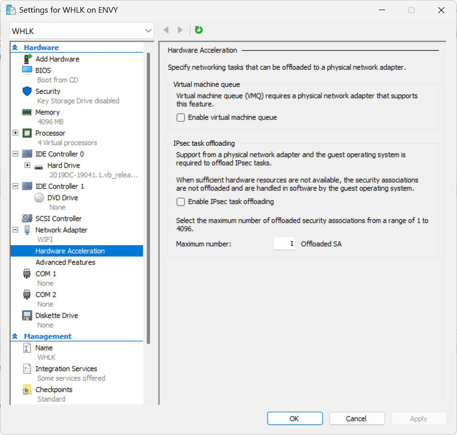

The goal is to certify drivers for Windows 10 Build 1809 and later.
The following steps should be done for each of these platforms, Windows 11 23H2 is used as an example.

- **Setup VHLK test server**
  - See [VHLK Getting Started Guide](https://learn.microsoft.com/en-us/windows-hardware/test/hlk/getstarted/getstarted-vhlk)
  - Install [Virtual HLK (VHLK) for Windows 11, version 23H2](https://go.microsoft.com/fwlink/p/?linkid=2196270&clcid=0x409&culture=en-us&country=us)
  - Update [Windows Hardware Lab Kit Filters](https://learn.microsoft.com/en-us/windows-hardware/test/hlk/user/windows-hardware-lab-kit-filters)
  - If network copying is slow between controller and client, use these settings
    - 
    - 
    - 
  - See also [Poor Network Performance on Hyper-V VMs in Windows Server 2019](https://woshub.com/poor-network-performance-hyper-windows-server/)
  - How to enable Hyper-V on Windows Home
    - [Hyper-V.bat](Hyper-V.bat)

- **Setup a dedicated Windows PC as a test system**
  - [Windows HLK Prerequisites](https://learn.microsoft.com/en-us/windows-hardware/test/hlk/getstarted/windows-hlk-prerequisites)
  - Install [Windows 11 (business editions), version 23H2](https://my.visualstudio.com/downloads) on dedicated physical machine (test client)
  - Enable **test signing mode**
    - Run as Administrator: **bcdedit /set testsigning on**
    - Reboot the PC
  - Install **Release** build
  - Disconnect all drives except the system (C:\) to reduce scanning time for viruses (“Detect Malicious Software" test)

- **Continue from** [Step 2 Install Client on the test system(s)](https://learn.microsoft.com/en-us/windows-hardware/test/hlk/getstarted/step-2--install-client-on-the-test-system-s-)
  - See also [VHLK Connecting Desktop Clients](https://learn.microsoft.com/en-us/windows-hardware/test/hlk/getstarted/vhlk-desktop-devices)
- [Select target to test](https://learn.microsoft.com/en-us/windows-hardware/test/hlk/getstarted/step-5--select-target-to-test) - select **“USBip 3.X Emulated Host Controller”** in Device Manager
- Load Windows Hardware Compatibility playlist
  - Download the [playlist](https://learn.microsoft.com/en-us/windows-hardware/test/hlk/#download-windows-hardware-compatibility-playlist), extract it on the test controller
  - HLK Studio, select “Tests“ tab and click “Load playlist“
  - Select “HLK Version 23H2 CompatPlaylist x64 ARM64.xml“
- Prepare data for **“Static Tools Logo Test“**
  - Read instructions from [codeql.txt](codeql.txt)
  - See also [CodeQL and the Static Tools Logo Test](https://learn.microsoft.com/en-us/windows-hardware/drivers/devtest/static-tools-and-codeql)
  - See also [How to Create a Driver Verification Log](https://learn.microsoft.com/en-us/windows-hardware/drivers/develop/creating-a-driver-verification-log)
- If **“DF - Fuzz zero length buffer IOCTL test (Reliability)”** is on the list, it has been running for about 4-5 hours instead of 15 minutes. To fix that, set test’s parameters **MinFunctionCode** and **MaxFunctionCode**, see "enum class function" in [vhci.h](../include/usbip/vhci.h).
- Run all tests and [create a submission package](https://learn.microsoft.com/en-us/windows-hardware/test/hlk/getstarted/step-8-create-a-submission-package) for the tested platform

**Windows 11 24H2** (test controller and client) have critical issue: **“Network path not found, error 0x80070035”** when trying to access shares on other computers. To fix that
- Run **services.msc** and make sure that the following Windows services are running
  - Function Discovery Provider Host
  - Function Discovery Resource Publication
  - SSDP Discovery
  - UPnP Device Host
- Run “Group Policy Editor” **gpedit.msc**
  - Open **“Computer Configuration\Administrative Templates\Network\Lanman Workstation”**
  - On the right, open the **"Enable insecure guest logons"** policy
  - Set the policy to **Enabled** and click Apply > OK
- Open **“Computer Configuration\Windows Settings\Security Settings\Local Policies\Security Options”**
  - At the right pane, make sure that the following two policies are **Disabled**
  - **Microsoft Network Client: Digitally sign communications (always)**
  - **Microsoft Network Client: Digitally sign communications (if server agrees)**
  - Reboot Windows
- See [FIX: Windows 11 24H2 Cannot Access Network Shares (0x80070035)](https://www.wintips.org/fix-windows-11-24h2-cannot-access-network-shares-0x80070035/)

If credential is required to access test controller, enter username HLKADMINUSER and default password "Testpassword,1"
